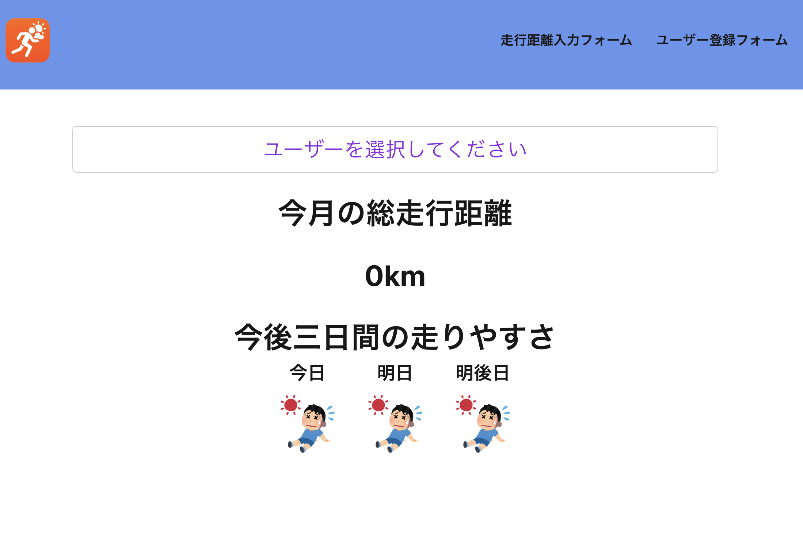
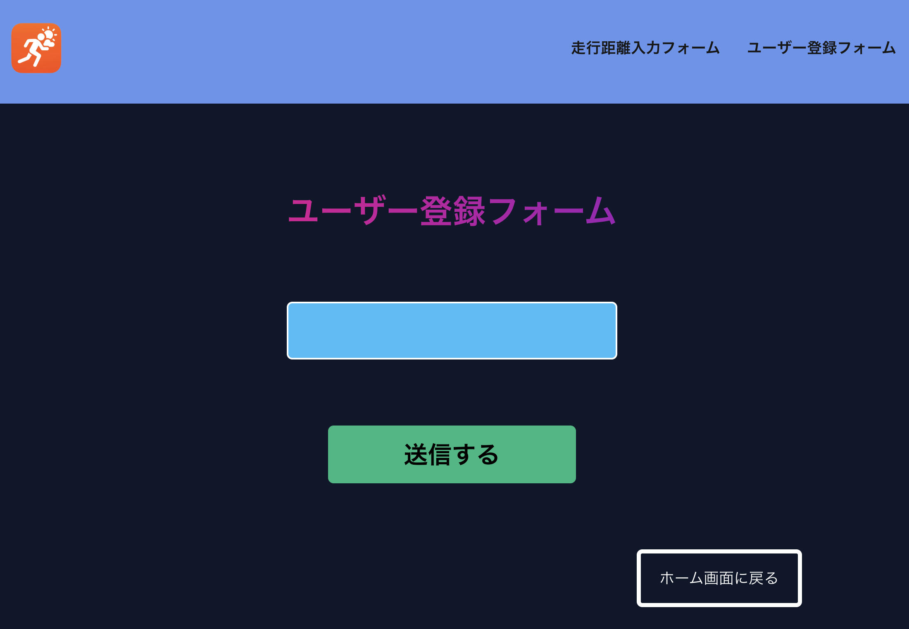
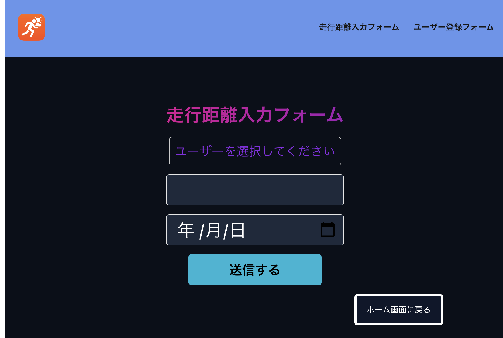
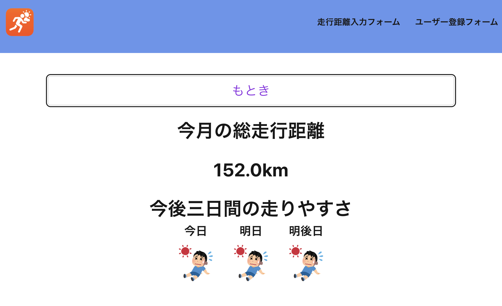
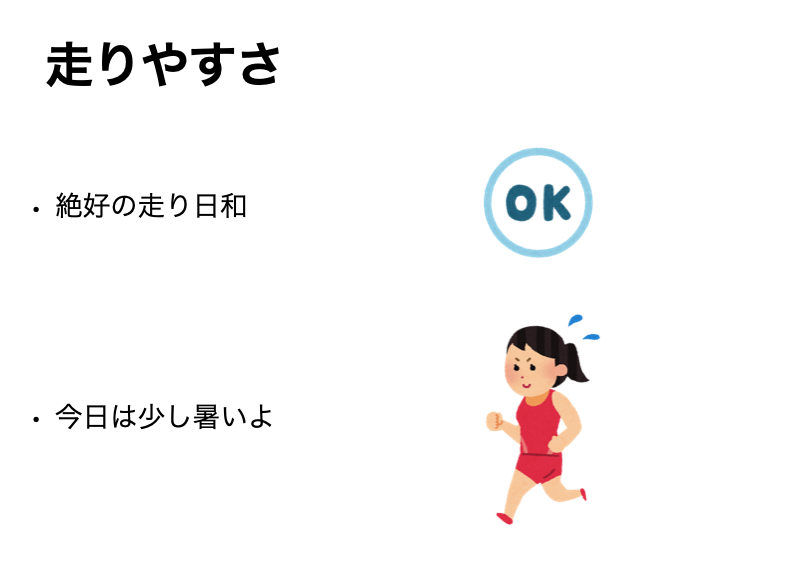
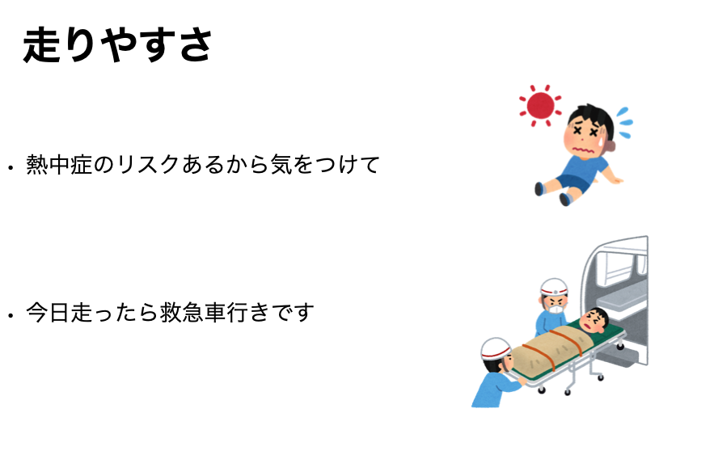

# RunApp

## このアプリの詳細

このアプリはランニングする人向けのアプリです。このアプリでできることが大きく分けて二つあります。
まず一つ目は天気の情報から湿度、気温を用いて走りやすさを表示しています。
二つ目は走った距離の記録です。
ユーザーごとに走った距離を記録することができます。

## 使い方

## ユーザー登録

まず、使い方として一番初めにしてもらいたいのはユーザーの登録です。下の画面の右上にあるユーザー登録フォームというところを押してもらうと、ユーザーの登録画面に移ります。

### ユーザ登録画面はこちらです

この水色のところに名前を書いてもらい、送信するで登録することができます。
このボタンを押してもらったら、自動的にホーム画面に戻るようになります

## 走行距離入力

次にやってもらいたいのは、自分が走った走行距離を入力してもらうことです。
ホーム画面右上にあります走行距離入力フォームを押してもらうと下の画面に遷移します。

そしたら、ユーザーを選んでもらい、その後自分が走った距離を真ん中のフォームに入力してください。
そして、次は日付を選んでもらい、あとは送信するを押してもらうと走行距離の登録ができます。　　　　　

## 走行距離の確認

ホーム画面にあるユーザーを選択してくださいというセレクトボックスを押してもらうと、登録してあるユーザーが表示してあるので、そこから自分の名前を選択してもらうと、今月走った距離が合計されて、出てきます。

このような形で見ることができます。

# 走りやすさの表

